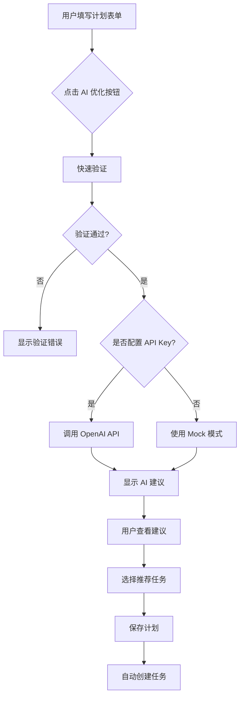

# AI 智能优化功能 - 开发完成报告

## ✅ 已完成的工作

### 1. 核心功能实现

#### AI 服务模块 (`src/services/ai.ts`)
- ✅ OpenAI API 集成
- ✅ 智能提示词构建
- ✅ 错误处理和降级机制
- ✅ Mock 模式支持（无 API Key 时）
- ✅ 快速验证功能

#### AI 建议组件 (`src/components/plan/AISuggestions.vue`)
- ✅ 美观的渐变卡片设计
- ✅ 加载动画
- ✅ 三种建议类型展示（警告/建议/信息）
- ✅ 推荐任务列表
- ✅ 一键添加任务功能
- ✅ 应用优化建议按钮
- ✅ 可展开的分析说明

#### 计划创建页面更新 (`src/pages/Plan/PlanCreatePage.vue`)
- ✅ AI 优化按钮集成
- ✅ 待创建任务列表
- ✅ 自动创建推荐任务
- ✅ 表单联动（修改后清除建议）
- ✅ 完整的状态管理

### 2. 类型系统

#### API 类型定义 (`src/services/api.types.ts`)
- ✅ `AISuggestion` 接口
- ✅ `AIOptimizePlanRequest` 接口
- ✅ `AIOptimizePlanResponse` 接口
- ✅ `APIInterface` 扩展

### 3. 配置管理

#### 全局配置 (`src/config.ts`)
- ✅ `AI_ENABLED` 开关
- ✅ `AI_API_KEY` 配置
- ✅ `AI_API_BASE_URL` 配置
- ✅ `AI_MODEL` 配置

#### 环境变量 (`.env.example`)
- ✅ OpenAI API Key 模板
- ✅ 自定义 API 端点支持

### 4. 测试覆盖

#### 单元测试 (`src/services/__tests__/ai.spec.ts`)
- ✅ 标题验证测试
- ✅ 日期逻辑测试
- ✅ 过期日期检测测试
- ✅ 正常计划验证测试
- ✅ 所有测试通过 ✓

### 5. 文档

- ✅ [AI_FEATURE_GUIDE.md](AI_FEATURE_GUIDE.md) - 详细使用指南
- ✅ README.md 更新 - 添加 AI 功能说明
- ✅ `.env.example` - 环境配置模板

## 🎯 功能特性

### AI 分析能力

1. **时间安排分析**
   - 检测计划时长是否合理
   - 短期计划（<3天）警告
   - 长期计划（>90天）拆分建议
   - 中期计划（7-30天）适合性提示

2. **内容质量检查**
   - 标题长度和描述性检查
   - 描述完整性建议
   - 清晰度优化建议

3. **智能任务拆解**
   - 基于关键词的任务生成
   - 学习类计划：学习计划、练习、笔记、复习
   - 健身类计划：训练计划、记录、监测、饮食
   - 阅读类计划：阅读、笔记、总结、分享
   - 工作类计划：拆解、里程碑、回顾、风险

4. **快速验证**
   - 日期有效性检查
   - 必填字段验证
   - 逻辑错误检测

### 用户体验

1. **渐进式增强**
   - 无 API Key 时仍可使用 Mock 建议
   - 网络错误时自动降级
   - 不影响核心功能使用

2. **交互友好**
   - 实时表单验证
   - 加载状态提示
   - 一键操作（添加任务、应用优化）
   - 可撤销的任务选择

3. **视觉设计**
   - 渐变色卡片设计
   - 清晰的图标系统
   - 响应式布局
   - 平滑动画效果

## 📊 技术架构

```
用户界面层
  ├─ PlanCreatePage.vue (计划创建页面)
  └─ AISuggestions.vue (AI 建议组件)
         ↓
服务层
  ├─ ai.ts (AI 服务)
  │   ├─ optimizePlanWithAI() - OpenAI API 调用
  │   ├─ generateMockSuggestions() - Mock 建议生成
  │   └─ quickValidatePlan() - 快速验证
  └─ api.types.ts (类型定义)
         ↓
配置层
  └─ config.ts (全局配置)
         ↓
环境变量
  └─ .env.local (敏感配置)
```

## 🔧 使用流程



## 🚀 部署说明

### 开发环境

1. 复制环境变量模板：
   ```bash
   cp .env.example .env.local
   ```

2. 编辑 `.env.local` 添加 API Key：
   ```env
   VITE_OPENAI_API_KEY=sk-your-key-here
   ```

3. 启动开发服务器：
   ```bash
   npm run dev
   ```

### 生产环境

1. 设置环境变量（根据部署平台）：
   - Vercel: Settings → Environment Variables
   - Netlify: Site settings → Environment
   - Docker: `.env` 文件或 `-e` 参数

2. 构建生产版本：
   ```bash
   npm run build
   ```

## 💰 成本估算

### OpenAI API 使用

- 每次优化调用：约 200-500 tokens
- GPT-4o-mini 价格：$0.15/1M input tokens
- 单次成本：约 $0.0001-0.0003（不到 1 分钱）
- 100 次优化：约 $0.01-0.03

### 建议

- 开发测试：使用 Mock 模式
- 个人使用：配置 API Key，成本极低
- 商业部署：考虑设置使用限制或用户配额

## ⚙️ 配置选项

### 禁用 AI 功能

在 `src/config.ts` 中：
```typescript
AI_ENABLED: false
```

### 切换 AI 模型

```typescript
AI_MODEL: "gpt-4" // 更强大但更贵
AI_MODEL: "gpt-3.5-turbo" // 更便宜
AI_MODEL: "gpt-4o-mini" // 平衡选择（默认）
```

### 使用自定义 API

```env
VITE_OPENAI_BASE_URL=https://your-custom-endpoint.com/v1
```

## 📈 未来改进方向

### 短期（1-2周）
- [ ] 添加 AI 建议历史记录
- [ ] 支持任务优先级排序
- [ ] 添加更多计划类型的智能模板

### 中期（1-2月）
- [ ] 根据用户历史数据个性化建议
- [ ] 时间冲突检测和智能调度
- [ ] 多语言支持

### 长期（3-6月）
- [ ] 自然语言计划创建（直接描述需求）
- [ ] 智能进度预测
- [ ] 自适应任务难度调整

## 🐛 已知限制

1. **网络依赖**：需要访问 OpenAI API
2. **响应速度**：取决于 API 响应时间（通常 2-5 秒）
3. **准确性**：AI 建议仅供参考，用户需自行判断
4. **隐私**：计划数据会发送到 OpenAI（可选择不使用）

## ✅ 验收标准

- [x] 功能完整实现
- [x] 类型系统完善
- [x] 单元测试通过
- [x] 文档完整
- [x] 错误处理完善
- [x] Mock 模式可用
- [x] 用户体验友好
- [x] 代码规范统一

## 🎉 总结

AI 智能优化功能已完整实现并集成到计划创建流程中。功能包括：

- ✨ 智能分析和建议
- 📋 自动任务拆解
- 🎯 一键应用优化
- 🔄 降级和容错
- 📚 完整文档
- ✅ 测试覆盖

用户现在可以享受 AI 辅助的智能计划管理体验！
